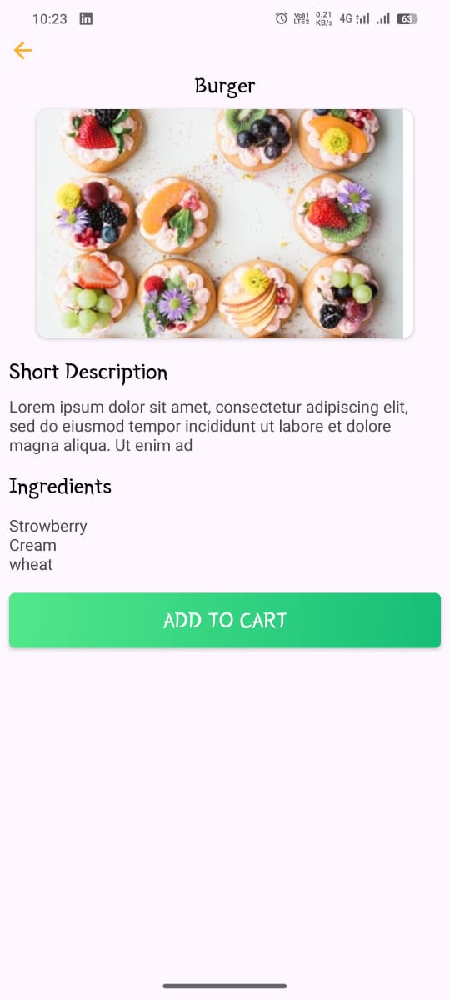
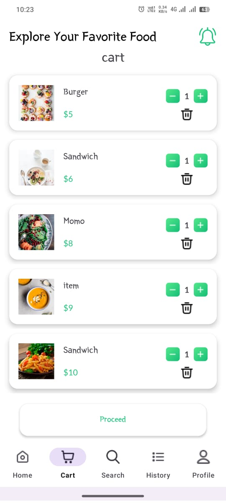
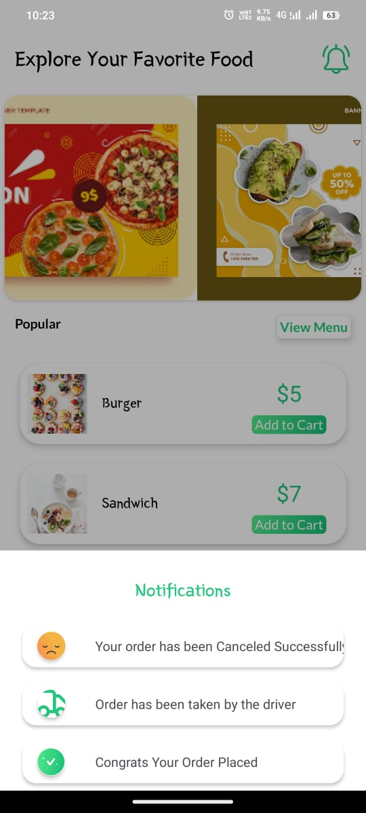
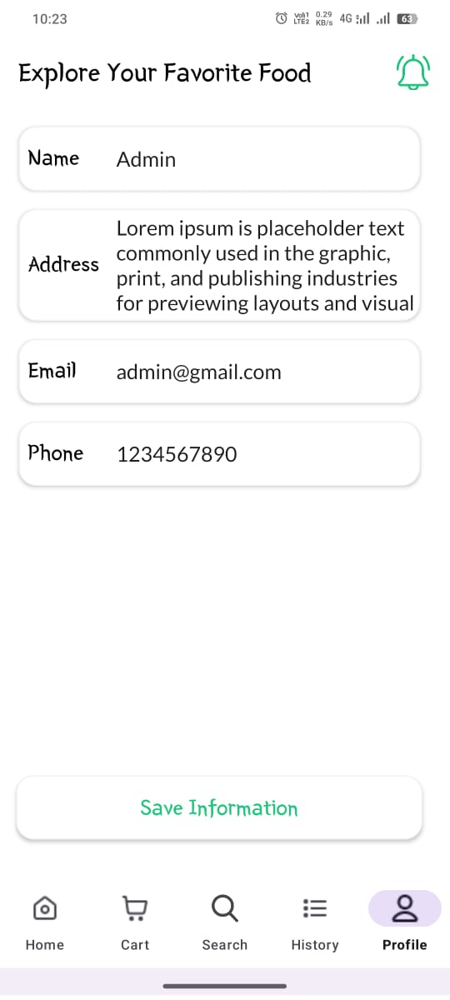

# 🍽️ Waves of Food

**Waves of Food** 🍔 is a food ordering Android application built using **Kotlin**, **Jetpack Compose**, and **Firebase** to explore real-world Android app development concepts.

Waves of Food focuses on implementing modern Android features such as authentication, food browsing, cart management, and order placement.

---

## 🚀 Features

- 🔐 User Authentication (Login / Signup)
- 🍔 Browse food items and categories
- 🛒 Add to Cart functionality
- 📦 Place food orders
- 🧾 Order history tracking
- 🎨 Clean and responsive UI
- ⚡ Realtime data handling using Firebase

---

## 🛠️ Tech Stack

- **Language:** Kotlin  
- **UI:** Jetpack Compose  
- **Architecture:** MVVM  
- **Backend:** Firebase  
  - Firebase Authentication  
  - Firebase Realtime Database  
- **Tools:** Android Studio, GitHub  

---

## 📱 Screenshots

### Home Screen

### Food Details

### Cart Page

### Notifications

### Profile

---

## 📚 Learning Outcome

This project helped me:

- Understand **Jetpack Compose UI**
- Implement **Firebase Authentication & Realtime Database**
- Manage application state efficiently
- Apply **MVVM architecture**
- Build end-to-end Android app features

---

## 👨‍💻 Author

**Shoaib Akhtar**  
Aspiring Software Developer | Android Developer  
BTech CSE Student  

---

⭐ If you find this project useful, feel free to star the repository!

